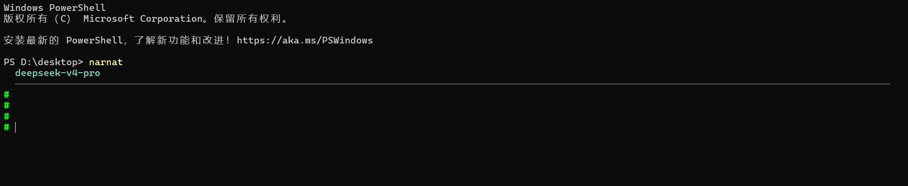
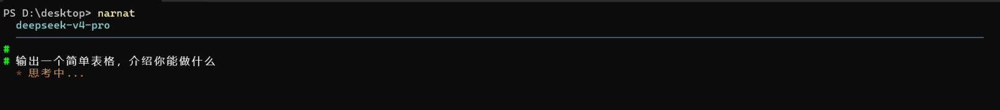
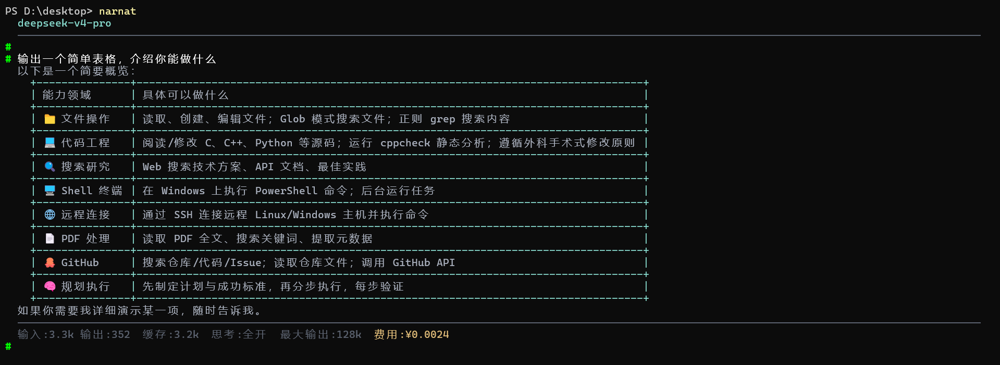
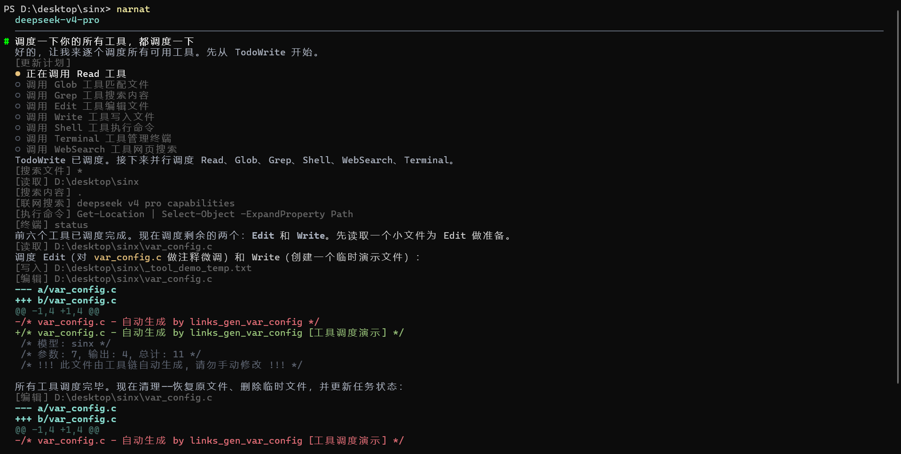
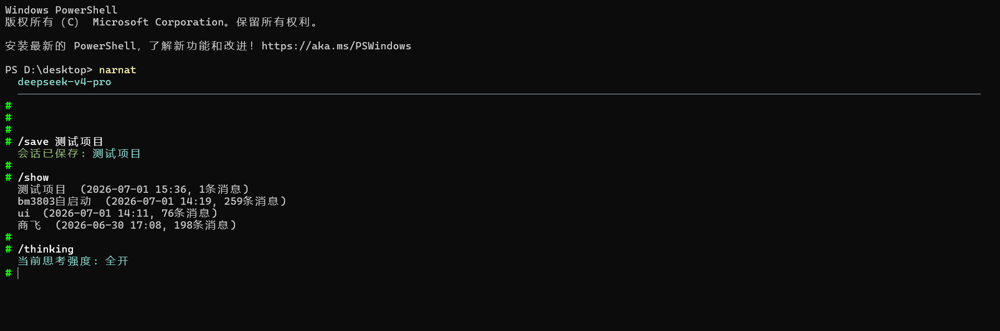
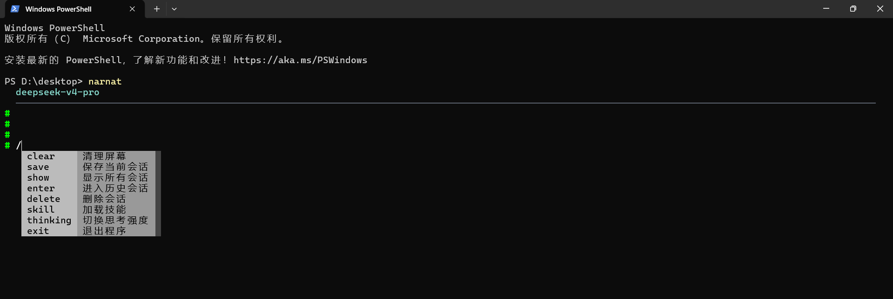

# Narnat Agent

Linux 风格的终端 AI 代码智能体。极简，只保留最核心的功能。

## 快速上手

### 1. 编译

从源码编译为单文件二进制。

**Windows**

| 组件 | 版本 |
|------|------|
| Nuitka | 4.1.2 |
| Python | 3.12.9 |
| C 编译器 | MSVC cl 14.3 |

```bash
pip install nuitka==4.1.2 httpx openai paramiko prompt_toolkit zstandard
python -m nuitka --onefile --output-dir=output --output-filename=narnat.exe \
  --jobs=16 --lto=yes --python-flag=no_docstrings --follow-imports \
  --include-module=openai \
  --nofollow-import-to=tkinter --nofollow-import-to=unittest --nofollow-import-to=unittest.mock \
  --nofollow-import-to=invoke --nofollow-import-to=test --nofollow-import-to=tests \
  --nofollow-import-to=setuptools --nofollow-import-to=pip --nofollow-import-to=distutils \
  main.py
```

产物 `output/narnat.exe`，约 30MB。

**Ubuntu**

| 组件 | 版本 |
|------|------|
| Nuitka | 4.1.2 |
| Python | 3.12.9 |
| C 编译器 | gcc 11.4.0 |

```bash
# 系统依赖
sudo apt install -y gcc patchelf build-essential libssl-dev zlib1g-dev \
  libbz2-dev libreadline-dev libsqlite3-dev libncursesw5-dev libgdbm-dev \
  liblzma-dev tk-dev libffi-dev

# Python 3.12.9（源码编译，不覆盖系统版本）
cd /tmp
wget https://npmmirror.com/mirrors/python/3.12.9/Python-3.12.9.tgz
tar xzf Python-3.12.9.tgz && cd Python-3.12.9
./configure --prefix=/usr/local/python3.12
make -j$(nproc) && sudo make install

# Nuitka + 依赖
/usr/local/python3.12/bin/pip3.12 install nuitka==4.1.2 httpx openai paramiko prompt_toolkit zstandard
```

编译命令与 Windows 相同（将 `python` 替换为 `/usr/local/python3.12/bin/python3.12`），耗时约 28 分钟。产物约 35MB，仅依赖 glibc ≥ 2.35。

### 2. 配置

首次运行会在当前目录生成 `.narnat/config/narnat.json`，编辑填入 API 密钥：

```jsonc
{
  "智能体": {
    "接口密钥": "sk-xxxxxxxx",
    "接口地址": "https://api.deepseek.com/anthropic",
    "模型": "deepseek-v4-pro",
    "协议": "anthropic"
  }
}
```

> **`"协议"`** 显式指定通信协议：`"anthropic"` 或 `"openai"`。支持 DeepSeek、GLM-5.2、Kimi K2.6、Qwen 3.7、GPT-5.5、Claude Opus 4.7 及任意兼容 API。换模型只需改 6-7 个字段，thinking 参数自动适配。

### 3. 开始对话

启动后进入 `#` 提示符，输入问题即可：



AI 流式输出回答，代码块含语法高亮，末尾显示 token 消耗：

 

AI 会按需自主调用工具——读文件、改代码、执行命令、搜索网络。多工具可并行执行，结果回传后继续推理：



## 交互命令

在 `#` 提示符下输入 `/` 开头的命令，支持 Tab 补全。命令在不同状态下可用性不同：

| 命令 | 说明 | 可用状态 |
|------|------|----------|
| `/save <名称>` | 保存当前会话 | 全部 |
| `/ls` | 列出所有已保存会话 | 全部 |
| `/cd <名称>` | 进入历史会话 | 全部 |
| `/rm <名称>` | 删除会话（退出时生效） | 全部 |
| `/explore <名称>` | 从当前会话创建探索分支 | RootSession |
| `/done` | 完成分支探索，AI 总结后合并回父会话 | ChildSession |
| `/skill <名称>` | 加载技能文件 | 全部 |
| `/thinking <强度>` | 切换思考强度（由 `"思考.强度选项"` 定义） | 全部 |
| `/clear` | 清屏 | 全部 |
| `/exit` | 退出会话/退出程序 | 全部 |
| `Esc` | 中断当前 AI 输出 | 全部 |

### 会话管理

Narnat 采用三态会话模型，支持**探索分支**——从任意会话分叉出子分支，在不影响主线的条件下验证想法，完成后由 AI 自动总结合并：

```
NoSession ──/save──▶ RootSession ──/explore──▶ ChildSession
    ▲                    ▲                         │
    │                    │◀────── /done ───────────┘
    │◀─── /exit ─────────┘
```

- **RootSession**：常规工作会话，`/save` 持久化后可通过 `/cd` 随时恢复
- **ChildSession**：探索分支，继承父会话全部上下文，`/done` 时 AI 将分支讨论总结为结构化结论，追加到父会话末尾；`/exit` 暂离可稍后 `/cd` 回来继续

> 子分支通过 `父名/子名` 路径引用。`/ls` 以树形展示所有会话及其关系。

### 技能系统

`.narnat/config/skills/` 目录下的 Markdown 文件即为技能。用户输入 `/skill <名称>` 将技能内容作为系统指令注入到当前对话中，用于切换 AI 的工作模式或行为风格。

 

## 命令行参数

```
narnat -h         查看帮助
narnat -v         显示版本号
narnat -d         调试模式（记录详细日志到 .narnat/logs/）
```

## 全部配置项

`.narnat/config/narnat.json`，首次运行自动生成。完整参考如下（`narnat.md` 中的 Markdown 会作为自定义系统指令追加到 prompt 末尾）：

```jsonc
{
  // ── 模型连接 ──
  "智能体": {
    "接口密钥": "sk-xxxxxxxx",
    "接口地址": "https://api.deepseek.com/anthropic",
    "模型": "deepseek-v4-pro",
    "协议": "anthropic",               // "openai" | "anthropic"
    "温度": null,
    "最大输出token数": 128000,
    "LLM重试次数": 3,

    // 思考模式
    "思考": {
      "启用": true,                    // 关闭则不传 thinking 参数
      "强度": "high",                  // 当前生效值
      "强度选项": {                    // 可选值 → 中文显示名
        "high": "高",
        "max": "全开"
      }
    }
  },

  // ── 余额查询（独立分组，支持 DeepSeek / Kimi / GLM 等）──
  "余额查询": {
    "启用": true,
    "查询地址": "https://api.deepseek.com/user/balance",
    "认证方式": "bearer",              // "bearer" | "x-api-key"
    "响应路径": "balance_infos.0.total_balance",
    "货币路径": "balance_infos.0.currency"
  },

  // ── 定价 ──
  "定价": {
    "模型": {
      "deepseek-v4-pro": { "输入": 3.0, "缓存命中": 0.025, "输出": 6.0 },
      "deepseek-v4-flash": { "输入": 1.0, "缓存命中": 0.02, "输出": 2.0 }
    }
  },

  // ── 独立 API 密钥（WebSearch 等）──
  "接口密钥组": {
    "websearch": "",
    "websearch_url": "https://api.anysearch.com/mcp"
  },

  // ── 界面 ──
  "界面": {
    "显示费用": false,
    "显示余额": false,
    "用户输入色": "#FFFFFF",
    "AI输出色": "#D8DEE9",
    "标题色": "#5EEAD4",
    "成功色": "#A3BE8C",
    "行内代码色": "#EBCB8B",
    "错误色": "#BF616A",
    "链接色": "#81A1C1",
    "装饰色": "#B48EAD",
    "加载动画色": "#D08770",
    "次要文字色": "#4C566A",
    "代码块背景色": "#161821"
  },

  // ── 工具 ──
  "工具": {
    "输出上限KB": 20,
    "SSH最大会话数": 5,
    "最大传输文件MB": 100,
    "git免确认": false,
    "rm免确认": false
  },

  // ── 会话 ──
  "会话": {
    "自动保存": false,
    "自动保存Token量": 0            // 服务器输入token > 此值才自动保存，如"10k"=1万token；0=无门槛（输入即保存）
  },

  // ── 上下文压缩 ──
  "压缩": {
    "压缩轮次": 100,
    "警告轮次1": 50,
    "警告轮次2": 80
  },

  // ── 计划优先 ──
  "计划": {
    "计划优先": false,
    "计划最低工具数": 2
  },

  // ── 文件操作 ──
  "忽略目录": [
    ".git", "__pycache__", "node_modules", ".svn", ".hg",
    "venv", ".venv", ".pytest_cache"
  ]
}
```

### 多模型适配

thinking 参数由内部映射表自动翻译为对应厂商的 API 格式，无需手动写 `extra_body`。

**切换到其他模型：修改 `narnat.json` 的 `"智能体"` 分组中 4 个字段即可。** 以下为各厂商的完整配置模板，直接照填：

| 厂商 | `"接口密钥"` | `"接口地址"` | `"模型"` | `"协议"` |
|------|-------------|-------------|---------|---------|
| DeepSeek（推荐） | `sk-xxx` | `https://api.deepseek.com/anthropic` | `deepseek-v4-pro` | `anthropic` |
| DeepSeek (OpenAI) | `sk-xxx` | `https://api.deepseek.com/v1` | `deepseek-v4-pro` | `openai` |
| 智谱 GLM | 你的 GLM 密钥 | `https://open.bigmodel.cn/api/paas/v4` | `GLM-4.7` | `openai` |
| Kimi | 你的 Kimi 密钥 | `https://api.moonshot.cn/v1` | `kimi-k2.6` | `openai` |
| 阿里 Qwen | 你的 DashScope 密钥 | `https://dashscope.aliyuncs.com/compatible-mode/v1` | `qwen3-235b-a22b` | `openai` |
| OpenAI GPT | `sk-xxx` | `https://api.openai.com/v1` | `gpt-5.1` | `openai` |
| Anthropic Claude | `sk-ant-xxx` | `https://api.anthropic.com` | `claude-sonnet-4-20250514` | `anthropic` |

> **`"协议"`** 选择了 `anthropic` 还是 `openai` 取决于厂商的 API 端点格式，不是随便填的。表中已标出，跟着写即可。

切换模型时 **`"余额查询"` 和 `"定价"` 也需要同步修改**，否则费用显示不准：

```jsonc
// 智谱 GLM 示例
"余额查询": {
  "启用": true,
  "查询地址": "https://open.bigmodel.cn/api/paas/v4/account/info",
  "认证方式": "bearer",
  "响应路径": "data.balance",
  "货币路径": "data.currency"
},
"定价": {
  "模型": { "GLM-4.7": { "输入": 50.0, "输出": 50.0 } }
}

// DeepSeek 示例
"余额查询": {
  "启用": true,
  "查询地址": "https://api.deepseek.com/user/balance",
  "认证方式": "bearer",
  "响应路径": "balance_infos.0.total_balance",
  "货币路径": "balance_infos.0.currency"
}
```

**thinking 参数映射表（仅供参考，无需手动配置）：**

| 模型 | `"协议"` | `"思考"` 映射 |
|------|----------|--------------|
| DeepSeek V4 (Anthropic) | `"anthropic"` | `thinking: {type:"enabled"}` + `output_config.effort` |
| DeepSeek V4 (OpenAI) | `"openai"` | `extra_body.thinking` + `reasoning_effort` |
| GLM-5.2 | `"openai"` | `thinking` (顶层) + `reasoning_effort` |
| Kimi K2.6/K2.7-code | `"openai"` | `extra_body.thinking` |
| Qwen 3.7 | `"openai"` | `extra_body.enable_thinking` + `thinking_budget` |
| GPT-5.5 | `"openai"` | `reasoning_effort` |
| Claude Opus 4.7/Sonnet 5 | `"anthropic"` | `thinking: {type:"adaptive"}` + `effort` |

## 项目结构

```
NarnatAgent/
├── main.py                       # 入口
├── narnat_agent/
│   ├── core/                     # Agent 主循环、LLM 双协议、上下文压缩、会话状态机
│   ├── tools/
│   │   ├── read/                 # Read   — 读取文件
│   │   ├── glob/                 # Glob   — 按模式匹配文件
│   │   ├── grep/                 # Grep   — 正则搜索文件内容
│   │   ├── edit/                 # Edit   — 字符串/行号替换编辑
│   │   ├── write/                # Write  — 创建/覆盖文件
│   │   ├── bash/                 # Shell  — 本地命令行执行
│   │   ├── terminal/             # Terminal — 多终端持久 SSH + 文件传输
│   │   ├── web_search/           # WebSearch — 网页搜索
│   │   ├── todo_write/           # TodoWrite — 任务列表管理
│   │   ├── registry.py           # 工具注册表
│   │   ├── diff_utils.py         # diff 生成
│   │   └── tool_context.py       # 工具运行时上下文
│   ├── ui/                       # prompt-toolkit 终端界面、流式 Markdown 渲染
│   ├── config/                   # 配置加载、会话持久化、技能管理
│   ├── output.py                 # 终端输出/颜色控制
│   └── logger.py                 # 日志
├── translator/                   # 旧版会话迁移工具
└── output/                       # 编译产物
```
