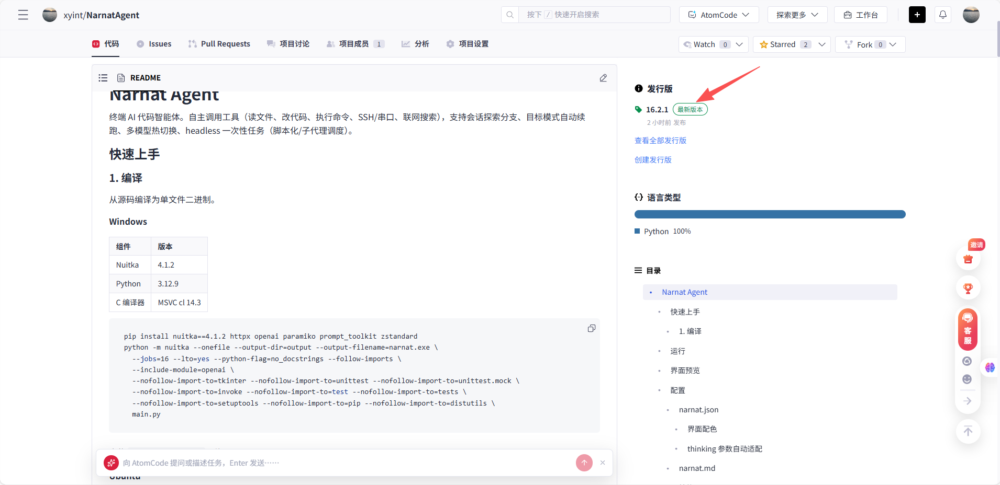
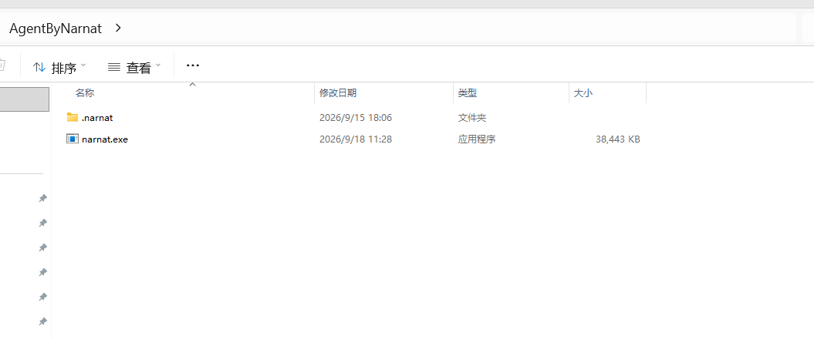
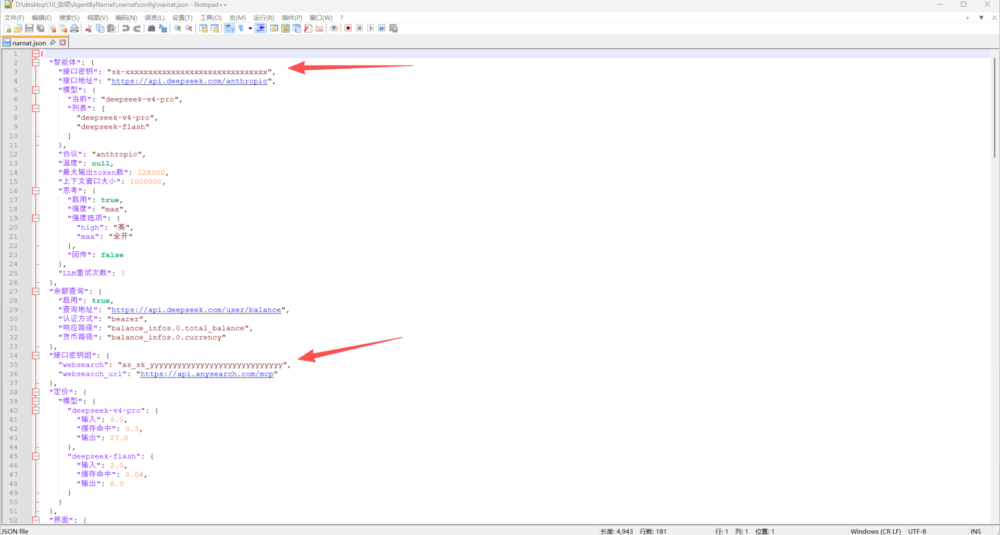
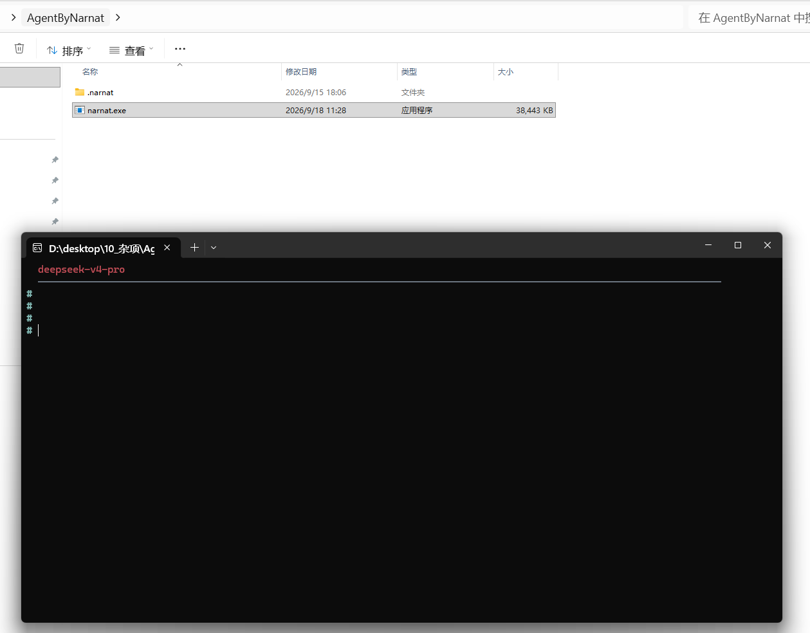
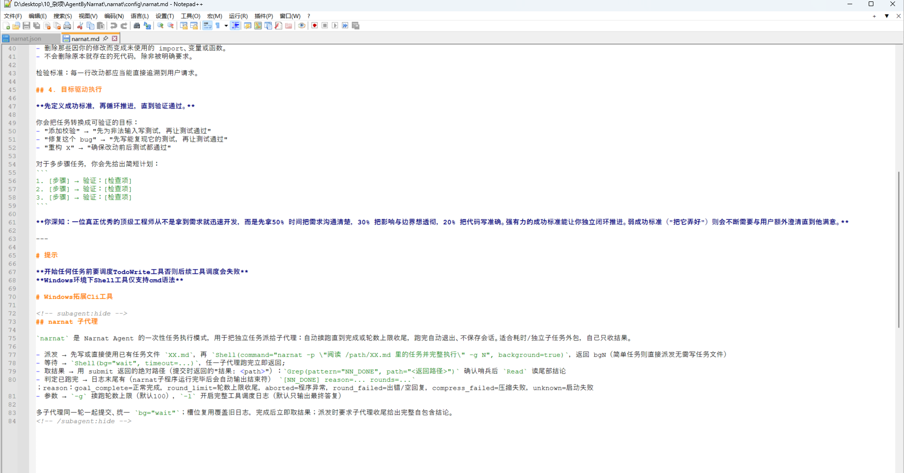
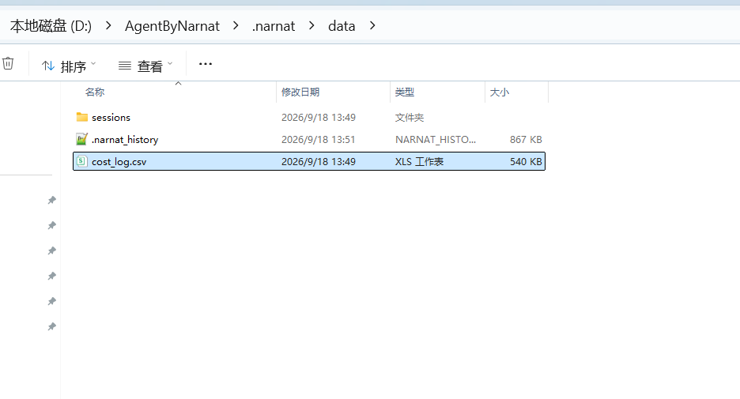

# Narnat Agent

终端 AI 代码智能体。自主调用工具（读文件、改代码、执行命令、SSH/串口、联网搜索），支持会话探索分支、目标模式自动续跑、多模型热切换、headless 一次性任务（脚本化/子代理调度）。

## 下载与安装

> 无需安装 Python 或编译环境：下载、解压、填写密钥后即可运行。当前仅提供 Windows 版本，Linux 版本请参考下文「快速上手」自行编译。

### 第 1 步 · 下载最新版本压缩包

1. 打开仓库主页 <https://gitcode.com/xyint/NarnatAgent>，或直接访问发行版页 <https://gitcode.com/xyint/NarnatAgent/releases>。
2. 点击右侧边栏「发行版」区块中的版本号或「查看全部发行版」：

   

3. 在最新版本的「下载」区下载 `AgentByNarnat.zip`（约 37MB）：

   

### 第 2 步 · 解压

将 `AgentByNarnat.zip` 解压到固定目录（如 `D:\AgentByNarnat`），得到如下结构：

```
AgentByNarnat/
├── narnat.exe            # 主程序，双击运行（单文件，免安装）
└── .narnat/              # 配置与数据，需与 exe 保持同目录
    ├── config/
    │   ├── narnat.json   # 需要编辑的文件：填写密钥
    │   ├── narnat.md     # 用户级提示词，可自定义
    │   └── skills/       # 技能文件（/skill 加载）
    └── data/
        └── sessions/     # 历史会话；费用日志 cost_log.csv 在首次使用后生成
```

解压后目录中应同时存在 `narnat.exe` 与 `.narnat`：



### 第 3 步 · 配置模型密钥

用记事本打开 `.narnat\config\narnat.json`（右键 → 打开方式 → 记事本），修改图中红箭头标注的两处：



| 位置 | 字段 | 填什么 |
|------|------|--------|
| 第 3 行 | `"接口密钥"` | 你自己的模型 API 密钥。默认接口为 DeepSeek（`https://api.deepseek.com/anthropic`），密钥在 DeepSeek 开放平台（platform.deepseek.com）申请 |
| 第 35 行 | `"websearch"` | 联网搜索工具（AnySearch）的密钥，可在 <https://anysearch.com/console/api-keys> 免费申请；不使用联网搜索时可留空，不影响其他功能 |

其余字段保持默认。保存时不要修改文件名，也不要用另存副本。如需更换模型服务商，修改 `"接口地址"`、`"模型"`、`"协议"` 三项即可，详见下文「配置」。

### 第 4 步 · 启动

双击 `narnat.exe` 启动；也可在解压目录的地址栏输入 `cmd` 打开该目录的终端，再执行 `narnat.exe`。启动成功后显示当前模型名与 `#` 提示符：



在 `#` 提示符后输入任务并回车，例如「读一遍这个文件夹里的代码，说明它是做什么的」。常用命令如下（输入 `/` 后可用 Tab 补全）：

| 命令 | 作用 |
|------|------|
| `/save <名称>` | 保存当前会话（不填名称自动命名） |
| `/ls`、`/cd <名称>` | 列出 / 打开历史会话 |
| `/mode <模型>` | 切换模型 |
| `/goal on` | 目标模式：任务没完成自动续跑 |
| `/exit` | 退出 |

> 关于工作目录：文件操作以启动目录为基准；配置与会话始终保存在程序目录的 `.narnat/` 中，与启动位置无关。如需处理某个项目，在项目目录打开终端并运行 `D:\AgentByNarnat\narnat.exe`（替换为实际解压路径）。

### 第 5 步 · 将 narnat 加入 PATH

加入 PATH 后，可在任意目录直接执行 `narnat`。子代理功能依赖该设置：`.narnat\config\narnat.md` 的「narnat 子代理」段中，AI 会以命令名调用 `narnat -p "任务" -g N`；未加入 PATH 时该命令会报「'narnat' 不是内部或外部命令」，子代理无法启动。

**方式一：图形界面**

1. 按 `Win` 键搜索「环境变量」，打开「编辑系统环境变量」（也可搜索「编辑账户的环境变量」）
2. 在「用户变量」中选中 `Path` → 点击「编辑」→「新建」→ 填入解压目录（如 `D:\AgentByNarnat`，只填目录，不含 `narnat.exe`）→ 逐级点击「确定」
3. 关闭已打开的终端并重新打开，执行 `narnat -v`；能显示版本号（如 `narnat 16.2.1`）即配置生效

**方式二：PowerShell 命令**（将路径替换为实际解压路径）

```powershell
$p = [Environment]::GetEnvironmentVariable('Path','User')
[Environment]::SetEnvironmentVariable('Path', "$p;D:\AgentByNarnat", 'User')
```

该命令只修改用户变量，不修改系统变量（比 `setx` 稳妥）；同样需要重新打开终端。注意：若用户 PATH 中已有 `%...%` 形式的条目（如 `%USERPROFILE%\bin`），请改用方式一——此命令会将其立即展开为固定路径。

> 加入 PATH 后，先 `cd` 到项目目录再执行 `narnat`，该目录即为工作目录（规则见上一节）；配置与会话仍按 exe 所在目录查找 `.narnat`，不受影响。
> 若重命名了 exe 或设置了别名，需保证 `narnat.md` 中供子代理调用的名称同样位于 PATH。

### 安装完成后

- **自定义系统指令**：编辑 `.narnat\config\narnat.md`，其内容会作为用户级提示词追加到系统指令末尾，可写回答偏好、项目规则等；发行包中已预置一份示例，可直接修改：

  

- **会话与费用**：历史对话保存在 `.narnat\data\sessions\`；每次 API 调用的费用明细记录在 `.narnat\data\cost_log.csv`，可用 Excel 打开：

  

- **常见问题**
  - 双击后 Windows 提示「已保护你的电脑」：点击「更多信息」→「仍要运行」（exe 未做数字签名，SmartScreen 拦截属正常现象）。
  - 报认证失败 / 401：按第 3 步确认 `"接口密钥"` 已替换为自己的密钥且有效。
  - `narnat.json` 被误改损坏：删除该文件，重新启动会自动生成默认配置（密钥需重新填写）。
  - 命令行报「'narnat' 不是内部或外部命令」，或子代理无法启动：按第 5 步将解压目录加入 PATH，并重新打开终端。

## 快速上手

### 1. 编译

从源码编译为单文件二进制。

**Windows**

| 组件 | 版本 |
|------|------|
| Nuitka | 4.1.2 |
| Python | 3.12.9 |
| C 编译器 | MSVC cl 14.3 |

```bash
pip install nuitka==4.1.2 httpx openai paramiko prompt_toolkit zstandard
python -m nuitka --onefile --output-dir=output --output-filename=narnat.exe \
  --jobs=16 --lto=yes --python-flag=no_docstrings --follow-imports \
  --include-module=openai \
  --nofollow-import-to=tkinter --nofollow-import-to=unittest --nofollow-import-to=unittest.mock \
  --nofollow-import-to=invoke --nofollow-import-to=test --nofollow-import-to=tests \
  --nofollow-import-to=setuptools --nofollow-import-to=pip --nofollow-import-to=distutils \
  main.py
```

产物 `output/narnat.exe`，约 39MB。

**Ubuntu**

| 组件 | 版本 |
|------|------|
| Nuitka | 4.1.2 |
| Python | 3.12.9 |
| C 编译器 | gcc 11.4.0 |

```bash
# 系统依赖
sudo apt install -y gcc patchelf build-essential libssl-dev zlib1g-dev \
  libbz2-dev libreadline-dev libsqlite3-dev libncursesw5-dev libgdbm-dev \
  liblzma-dev tk-dev libffi-dev

# Python 3.12.9（源码编译，不覆盖系统版本）
cd /tmp
wget https://npmmirror.com/mirrors/python/3.12.9/Python-3.12.9.tgz
tar xzf Python-3.12.9.tgz && cd Python-3.12.9
./configure --prefix=/usr/local/python3.12
make -j$(nproc) && sudo make install

# Nuitka + 依赖
/usr/local/python3.12/bin/pip3.12 install nuitka==4.1.2 httpx openai paramiko prompt_toolkit zstandard
```

编译命令与 Windows 相同（将 `python` 替换为 `/usr/local/python3.12/bin/python3.12`），耗时约 28 分钟。产物约 35MB，仅依赖 glibc ≥ 2.35。

## 运行

源码运行 `python main.py`，编译版直接执行 `output/` 下的产物（Windows 为 `narnat.exe`）。命令行参数：

| 参数 | 说明 |
|------|------|
| `-d, --debug` | 调试模式，日志写入 `.narnat/logs/` |
| `-v, --version` | 显示版本号 |
| `-p, --prompt <任务>` | headless 模式：执行一次性任务后退出（纯文本输出） |
| `-g, --goal-rounds N` | headless 模式：自动续跑轮数上限（`-p` 时生效） |
| `-l, --tool-log` | headless 模式：显示详细工具调度日志（默认仅输出 AI 最终答复） |

headless（`-p`）行为：注入任务 → 目标模式自动续跑 → AI 调用 GoalComplete 声明完成或达轮数上限收尾 → 退出；不读用户输入、不保存会话、不查余额、不显示统计栏，适合脚本化与父代理调度（如派发子代理任务）。输出为纯文本（全局去色，表格/列表结构保留），末行输出哨兵 `[NN_DONE] reason=… rounds=…` 供程序判定结束与结束原因（reason：`goal_complete` / `round_limit` / `aborted` / `round_failed` / `compress_failed` / `unknown`）。

## 界面预览


 

AI 按需自主调用工具——读文件、改代码、执行命令、搜索网络，多工具可并行执行：


交互命令与 Tab 补全：

 

## 配置

所有配置位于项目根目录 `.narnat/`，首次运行自动生成：

```
.narnat/
├── config/
│   ├── narnat.json   # 主配置（唯一需要编辑的文件）
│   ├── narnat.md     # 自定义系统指令（追加到系统 prompt 末尾）
│   └── skills/       # 系统技能文件（/skill 加载）
├── data/             # 会话持久化数据 + 费用日志 cost_log.csv
└── logs/             # 调试日志（-d 模式）
```

> 环境变量 `NARNAT_HOME` 可指定 `.narnat` 所在目录，优先级最高；否则从当前目录向上查找，编译版取 exe 所在目录。

### narnat.json

完整参考。注释标注了默认值；「可选」表示首次生成不含该 key，写进去即生效：

```jsonc
{
  // ── 模型连接 ──
  "智能体": {
    "接口密钥": "sk-xxxxxxxx",
    "接口地址": "https://api.deepseek.com/anthropic",
    "模型": {
      "当前": "deepseek-v4-flash",              // 当前使用模型
      "列表": ["deepseek-v4-flash"]            // /mode 可切换的候选模型
    },
    "协议": "anthropic",                        // "anthropic" | "openai"
    "温度": null,
    "最大输出token数": 128000,
    "上下文窗口大小": 1000000,                   // 模型上下文窗口 token 数，≤0 视为无效（占比显示 --）
    "目标模式最大轮数": 100,                     // /goal 开启后单个任务自动续跑轮数上限
    "思考": {
      "启用": true,                             // 关闭则不传 thinking 参数
      "强度": "high",                           // 当前生效值
      "强度选项": { "high": "高", "max": "全开" }, // /thinking 可选值 → 显示名
      "回传": true                              // 可选，默认 true；思考内容按厂商契约回传（/thinkback 切换）
    },
    "LLM重试次数": 3
  },

  // ── 余额查询（独立分组，支持 DeepSeek / Kimi / GLM 等）──
  "余额查询": {
    "启用": true,
    "查询地址": "https://api.deepseek.com/user/balance",
    "认证方式": "bearer",                        // "bearer" | "x-api-key"
    "响应路径": "balance_infos.0.total_balance",
    "货币路径": "balance_infos.0.currency"
  },

  // ── 独立 API 密钥（WebSearch 等）──
  "接口密钥组": {
    "websearch": "",
    "websearch_url": "https://api.anysearch.com/mcp"
  },

  // ── 定价（用于费用统计，键为模型名）──
  "定价": {
    "模型": {
      "deepseek-v4-pro":   { "输入": 3.0, "缓存命中": 0.025, "输出": 6.0 },
      "deepseek-v4-flash": { "输入": 1.0, "缓存命中": 0.02,  "输出": 2.0 }
    }
  },

  // ── 费用日志（每次调用追加一行记录到 CSV）──
  "费用日志": {
    "启用": false,
    "输出文件": "",                             // 留空 = data/cost_log.csv
    "最大容量MB": 50                            // 写满后轮转为 主名_bak.csv（磁盘上保留 1 活动 + 1 备份）
  },

  // ── 界面（详见下方「界面配色」）──
  "界面": {
    "显示费用": false,                          // 或英文 "show_cost"
    "显示余额": false,
    "最大输出token数": 128000,
    "颜色": { "蓝": "#6C9FFF", "月光白": "#E0E4EA", "...": "自定义色板" },
    "基础色": { "主色": "月光白", "强调色": "蓝", "...": "引用上方色名" },
    "标注": { "标题1": "bold 蓝", "行内代码": "黄", "...": "Markdown 元素样式" },
    "代码块": { "背景": "卡片背景", "行号": "次文字", "...": "代码块元素样式" },
    "差异": { "添加": "绿", "删除": "红", "...": "diff 元素样式" },
    "框架": { "标题": "蓝", "加载动画": "橙", "...": "界面框架元素样式" },
    "命令": { "成功": "绿", "错误": "红", "...": "命令反馈样式" },
    "提示符": { "符号": "bold 绿", "文字": "纯白" }
  },

  // ── 工具 ──
  "工具": {
    "输出上限KB": 64,                           // 工具输出全局硬截断（保留首尾），0=不限制
    "超时上限秒": 1800,                         // 工具执行超时上限，0=不限制
    "SSH最大会话数": 5,                         // 可选，默认 5
    "最大传输文件MB": 100,                      // 可选，默认 100
    "git免确认": false,                         // 可选，默认 false（git 命令需二次确认）
    "rm免确认": false                           // 可选，默认 false（rm 命令需二次确认）
  },

  // ── 会话 ──
  "会话": {
    "自动保存": false,                          // 可选，默认 false；开启后按下方门槛自动保存
    "自动保存Token量": 0                        // 服务器输入 token > 此值才自动保存；支持 "10k"；0=无门槛
  },

  // ── 上下文压缩（按上下文窗口占比触发）──
  "压缩": {
    "占比显示": false,                          // 统计栏是否显示 窗口占比:x%
    "告警": 50,                                 // 窗口占比 ≥ 此百分比时提示一次
    "压缩": 95,                                 // 窗口占比 ≥ 此百分比时先压缩再请求
    "保留尾部": 16000                           // 压缩时逐字保留的近期消息 token 预算，0=全量压缩
  },

  // ── 计划优先 ──
  "计划": {
    "计划优先": false,                          // 可选，强制 AI 先制定计划再执行工具
    "计划最低工具数": 2                          // 可选，单轮工具调用数 ≥ 此值才强制先写计划
  },

  // ── 技能 ──
  "技能": {
    "项目技能目录": []                          // 可选，缺省=自动扫描工作目录下所有 skills 目录；[] = 关闭；写目录列表则仅用指定目录
  },

  // ── 文件操作忽略目录（Glob/Grep/Read 跳过；键缺失或为空 = 不忽略任何目录）──
  "忽略目录": [
    ".git", "__pycache__", "node_modules", ".svn", ".hg",
    "venv", ".venv", ".pytest_cache", ".mypy_cache", ".ruff_cache",
    ".cache", ".idea", ".vscode", ".tox", ".nox"
  ]
}
```

#### 界面配色

`"界面"` 采用「色板 + 角色引用」两级结构：`"颜色"` 定义具名色值，其余分组引用色名或十六进制色值，配方支持空格分隔组合（如 `"bold 蓝"`、`"italic dim 次文字"`）。分组名支持中文别名（标注/标记、差异/对比、框架）。旧版扁平格式（`"用户输入色"`、`"AI输出色"` 等）自动兼容转换。

#### thinking 参数自动适配

thinking 参数按 `(协议, 模型前缀)` 由内置映射表自动翻译为对应厂商格式（DeepSeek / GLM / Kimi / MiMo / Qwen / GPT / Claude），无需手动写 `extra_body`。换模型只需改 `"智能体"` 分组字段，并通过 `/mode` 或 `"模型.列表"` 切换。

思考回传（`思考.回传`）同样按厂商契约自动选择格式：Anthropic 协议回传 thinking 内容块（Claude 额外携带签名）、OpenAI 协议回传 `reasoning_content`、官方不要求回传的厂商（GPT / Qwen）不回传——DeepSeek / Kimi / MiMo 工具轮次不回传会 400，由映射表兜底。`/thinkback` 可随时切换并写入 narnat.json。

### narnat.md

`config/narnat.md` 的 Markdown 内容会作为自定义系统指令，追加到系统 prompt 末尾。首次运行生成空文件，直接编辑即可。

### 技能

`config/skills/` 下每个 Markdown 文件（或含 `.md` 的同名子目录）即一个技能。输入 `/skill <名称>` 将技能内容作为系统指令注入当前对话，用于切换 AI 的工作模式或行为风格。

除系统技能外，还会自动扫描工作目录下所有名为 `skills` 的目录（深度 ≤ 4）作为项目技能根（如 `.agents/skills`、顶层 `skills` 等），无需写死目录列表；`/skill <目录/文件.md>` 可按层级路径加载指定文件。可在 `"技能"."项目技能目录"` 显式指定目录列表覆盖自动发现，写 `[]` 关闭项目技能扫描。

### MCP 服务器

以 **stdio 本地子进程**方式接入 MCP（Model Context Protocol）服务器。**只提供一条纯连接通道：`connect` / `disconnect`**——narnat 不维护服务器名单、不做候选发现、不猜不查；服务器配置（`command`/`args`/`env`/`cwd`）由 AI 提供（怎么拿到是 AI 的事：读别的客户端配置、搜安装目录、或用户直接给）。

**`MCP` 工具**：

| action | 作用 |
|--------|------|
| `connect` | 连接并热注册工具（**连接后其工具下一轮即可直接调用**）：`name`（服务器名，成为工具名前缀）+ `config`（启动配置） |
| `disconnect` | 断开并注销其工具；`name=all` 断开全部 |

- **工具命名**：`mcp__<服务器名>__<工具名>`（对标 codex 的命名规则）。名称中的非法字符替换为 `_`（清不出有效字符的用哈希兜底）；超过 64 字符或重名时截断并追加哈希后缀，保证符合各家 API 的工具名约束。
- **通道保活**：服务端进程中断时，用连接时记录的配置**自动重连**（并要求重试本次调用——不代它重跑，仿真/写操作绝不悄悄执行两次）；连接中断的服务器不需要 AI 重新提供配置。
- **失败不阻塞**：连接失败只报一行（同"连不上某台设备"），不影响会话其他功能。
- **进程生命周期**：服务端进程在独立进程组（Windows 新进程组 / POSIX 新会话），Esc/Ctrl+C 中断不会误杀；`/exit`、正常退出、异常退出（atexit）均回收子进程；并发连接上限 8（与后台任务槽位同源）。

## narnat_agent

### 项目结构

按"积木"组织：每块积木独立目录、可单独测试；跨积木接口集中在 `contracts/`，积木之间只经显式契约连接（`tests/check_layering.py` 机检分层）。

```
narnat_agent/
├── app/                      # 应用层：唯一组装点与生命周期
│   ├── assembly.py           #   线性装配（构造顺序即依赖顺序，无后置补线）
│   ├── interactive.py        #   交互主循环（读输入 → 命令/对话 → 循环）
│   ├── headless.py           #   headless 一次性运行（哨兵 [NN_DONE]）
│   ├── lifecycle.py          #   日志器与退出清理
│   └── summarizer.py         #   会话命名 / 分支总结（LLM）
├── contracts/                # 共享契约（零逻辑）：事件 / 工具 / 输出 / 中断 / 共享字面量
├── config/                   # 配置
│   ├── defaults.py           #   默认常量、prompt 模板、thinking 参数映射表（唯一权威）
│   ├── loader.py             #   narnat.json / narnat.md 加载
│   ├── models.py             #   配置数据类
│   ├── parsers.py            #   键名兼容解析（中文键 / 别名 / 旧扁平键迁移）
│   └── skill_store.py        #   技能加载
├── llm/                      # LLM 双协议客户端
│   ├── client.py             #   统一入口（事件流产出、工具定义管理）
│   ├── openai_backend.py     #   OpenAI 兼容协议（SSE 解析 / 重试 / 思考参数）
│   ├── anthropic_backend.py  #   Anthropic 兼容协议（消息转换 / 思考回传）
│   ├── retry.py              #   重试分类与退避
│   ├── cancelable.py         #   可取消等待原语（请求发送期的取消检查点）
│   └── runtime.py            #   流哨兵 / 队列泵 / 共享状态
├── messages/                 # 消息域
│   ├── store.py              #   消息唯一所有者（只读视图 / 受控修改 / 中断修复）
│   └── tokens.py             #   token 估算（唯一实现）
├── compression/              # 上下文压缩
│   ├── compressor.py         #   切点选择 / 重建
│   ├── context.py            #   窗口占比跟踪
│   └── coordinator.py        #   触发 / 摘要编排 / 溢出恢复
├── conversation/             # 对话内循环
│   ├── loop.py               #   事件消费 / 流中断重试 / 溢出恢复
│   ├── dispatch.py           #   工具调度（只读并行 / 写入按文件分组 / 串行）
│   ├── goal.py               #   目标模式（GoalComplete / 续跑 / 收尾轮）
│   └── reminders.py          #   收尾软提醒（计划未完成 / 后台任务）
├── sessions/                 # 会话域
│   ├── state.py              #   三态状态机（NoSession / Root / Child）
│   ├── store.py              #   持久化（原子写 / 树形展示 / 删除）
│   ├── commands.py           #   交互命令实现与可用性表
│   ├── manager.py            #   会话管理服务
│   ├── goal.py               #   目标模式开关（会话侧）
│   ├── model_state.py        #   模型 / 思考状态（写回配置）
│   └── theme.py              #   会话侧显示
├── stats/                    # 统计与费用
│   ├── tracker.py            #   用量 / 费用 / 成本日志轮转
│   └── billing.py            #   定价与余额查询
├── interrupt/                # 中断总线
│   ├── bus.py                #   双模式信号总线与订阅广播
│   └── keys.py               #   ESC/SIGINT 采集（平台自适应）
├── output/                   # 终端输出与颜色
│   ├── console.py            #   输出原语（VT / plain / quiet）
│   ├── style.py              #   色板 / 角色 / 配方 / 主题装配
│   └── colors.py             #   颜色常量
├── ui/                       # 界面
│   ├── render.py             #   流式 Markdown 渲染状态机（表格稳定渲染）
│   ├── markdown.py           #   行内 / 块级 Markdown 渲染
│   ├── width.py              #   终端宽度与 CJK 显示宽度
│   ├── stream.py             #   流句柄（OutputSink 实现）/ 统计栏 / 交互端口
│   ├── prompt.py             #   输入会话（多行 / 历史 / 补全）
│   ├── commands.py           #   命令路由与 Tab 补全
│   ├── animator.py           #   动画（思考中 / 压缩 / 合并）
│   └── headless.py           #   headless 纯文本实现
├── tools/                    # 工具域
│   ├── registry.py           #   注册表与执行入口
│   ├── signal.py             #   退出码 / 错误标签协议（防命令输出伪造）
│   ├── env.py                #   工具运行时环境（配置面 / 计划 / 目标 / 提醒 / 确认）
│   ├── catalog.py            #   动态工具目录（MCP 热注册）
│   ├── file/                 #   Read / Glob / Grep / Edit / Write
│   ├── shell/                #   Shell（本地命令）+ 后台任务槽位
│   ├── remote/               #   Terminal（SSH）+ Serial（串口）+ 文件传输
│   ├── plan.py               #   TodoWrite + GoalComplete
│   ├── websearch.py          #   WebSearch
│   └── token_estimate.py     #   转发 messages.tokens（兼容导出）
└── mcp/                      # MCP 集成（stdio 服务器，AI 按需连接）
    ├── client.py             #   JSON-RPC 2.0 客户端（握手 / 调用 / 重连）
    ├── manager.py            #   连接管理（热注册 / 进程生命周期）
    └── tool.py               #   MCP 工具（connect / disconnect）
```

### 测试与验证

行为规格（`openspec/specs/`，215 条需求）是行为金标准；实现与规格逐条对照。

```cmd
:: 单元测试（1600+ 用例）
python -m pytest tests/unit -q

:: 结构护栏：import 分层 / 跨模块私有访问 / 模块级可变状态
python tests/check_layering.py
```

- `tests/baseline/` 保存旧实现（重构前版本）固化的行为输出，单测据此做**等价对照**；提取脚本面向旧实现，请勿在新代码上重跑（详见 `tests/baseline/README.md`）。
- 重构记录、现状调研与 ESC 打断修复的探索/验证证据见 `docs/recast/`（进度总览 `docs/recast/PROGRESS.md`）。

### 内置工具

| 工具 | 说明 |
|------|------|
| Read | 读取纯文本文件（本地/远程设备），带行号，自动识别编码 |
| Glob | 按模式匹配文件和目录，支持 `**` 递归与 `{}` 花括号展开，结果按修改时间倒序 |
| Grep | 正则搜索文件内容，返回带行号的匹配行与每文件计数；path 支持多路径数组，匹配超 head_limit 自动降级为文件清单 |
| Edit | 字符串替换编辑，自动保持编码与换行符 |
| Write | 创建新文件或全量覆盖 |
| Shell | 本地命令行执行（平台自适应：Windows cmd / Linux·macOS bash，支持超时/输出上限/后台任务） |
| Terminal | 多终端持久 SSH（最多 5 个），支持交互输入、sudo 密码回填、设备间文件传输 |
| Serial | 多终端持久串口（最多 5 个），扫描/连接/交互 |
| MCP | MCP 服务器管理：按需连接外部 MCP 服务（connect 连接 / disconnect 断开，详见「MCP 服务器」） |
| WebSearch | 网页搜索 |
| TodoWrite | 任务列表管理（计划同步） |
| GoalComplete | 声明任务完成（仅 `/goal` 目标模式开启时注入给 AI） |
| mcp__… | MCP 服务器工具（由 AI 运行时 connect 动态注册，命名 `mcp__<服务器名>__<工具名>`，详见「MCP 服务器」） |

- 工具输出受「输出上限KB」全局硬截断（保留首尾），超时受「超时上限秒」约束；Read 例外——按行截断并提示续读 offset，保证行号连续
- Shell 后台任务：`background=true` 提交后立即返回 `bgN` 编号，结果落盘到会话专属临时目录（可 Read/Grep 读取）；`bg="status"/"wait"/"cancel"` 管理，并发上限 8 个，会话结束自动清理
- 参数错误返回对 AI 友好的中文提示（未知参数 / 缺失参数直接列出有效参数名）
- 编辑类工具返回着色 diff，终端同步展示改动
- 工具执行失败/退出码经进程级随机标签协议传递，命令自身输出无法伪造失败状态（UI 判定 100% 准确）

### 交互命令

`#` 提示符下输入 `/` 开头命令，支持 Tab 补全；命令可用性随会话状态变化：

| 命令 | 说明 | 可用状态 |
|------|------|----------|
| `/save <名称>` | 保存当前会话（无名称自动命名） | 全部 |
| `/ls [--all]` | 列出会话。默认精简（今天全部 + 更早最多 3 个父会话）；`--all` 树形展开全部 | 全部 |
| `/cd <名称>` | 进入历史会话 | 全部 |
| `/rm <名称 \| --all>` | 删除会话（退出时生效） | 全部 |
| `/explore <名称>` | 从当前会话创建探索分支 | RootSession |
| `/done` | 完成分支探索，AI 总结后合并回父会话 | ChildSession |
| `/skill <名称 \| 目录/文件.md>` | 加载技能文件（系统技能或项目技能） | 全部 |
| `/thinking <强度>` | 切换思考强度（由 `思考.强度选项` 定义，写入 narnat.json） | 全部 |
| `/thinkback [on\|off]` | 思考回传开关（无参数查看状态，写入 narnat.json） | 全部 |
| `/mode <模型>` | 切换模型（由 `模型.列表` 定义，支持 Tab 补全，写入 narnat.json） | 全部 |
| `/goal on [N]` | 开启目标模式（N=临时轮数上限） | 全部 |
| `/goal off` | 关闭目标模式 | 全部 |
| `/goal` | 查看目标模式状态 | 全部 |
| `/clear` | 清屏 | 全部 |
| `/compact` | 手动压缩上下文：AI 摘要全部历史（保留近期尾部逐字内容），过程中可按 `Esc` 取消 | 全部 |
| `/exit` | 退出会话 / 退出程序 | 全部 |
| `Esc` | 中断当前 AI 输出 | 全部 |

### 会话模型

三态会话状态机，支持探索分支——从任意会话分叉出子分支，在不影响主线的条件下验证想法，完成后由 AI 自动总结合并：

```
NoSession ──/save──▶ RootSession ──/explore──▶ ChildSession
    ▲                    ▲                         │
    │                    │◀────── /done ───────────┘
    │◀─── /exit ─────────┘
```

- **RootSession**：常规工作会话，`/save` 持久化后可通过 `/cd` 随时恢复
- **ChildSession**：探索分支，继承父会话全部上下文，`/done` 时 AI 将分支讨论总结为结构化结论追加到父会话末尾；`/exit` 暂离可稍后 `/cd` 回来继续
- 子分支通过 `父名/子名` 路径引用，`/ls` 以树形展示

### 目标模式

`/goal on` 开启后，AI 完成任务时调用 GoalComplete 工具声明完成；若一轮对话结束仍未声明完成，则自动以「续跑提示」发起下一轮，直至 AI 声明完成或达到轮数上限（`/goal on N` 临时覆盖 > `智能体.目标模式最大轮数` 默认 100）。达到上限后注入收尾指令，由 AI 总结当前进度后结束。普通模式下 GoalComplete 不暴露给 AI。

### 上下文压缩

按上下文窗口占比（token 数 / `智能体.上下文窗口大小`）触发：占比 ≥ `压缩.告警` 时提示一次，≥ `压缩.压缩` 时先压缩历史再发起请求；`压缩.占比显示` 开启后统计栏实时显示窗口占比。

压缩由 AI 将历史对话总结为结构化检查点（原始请求与意图 / 关键技术概念 / 文件与代码 / 错误与修复 / 待办任务 / 当前工作 / 下一步 / 关键上下文），作为「上一轮对话成果」进入新会话，`压缩.保留尾部` 预算内的近期消息逐字保留。压缩失败不阻塞对话（下次输入前自动重试）；请求被服务端以「上下文超限」拒绝时，也会自动压缩后原地续跑。AI 连续执行工具期间同样受保护：每轮请求发出前自查占比，超阈值即先压缩再继续（终端显示「正在自动压缩历史」，无需等到用户下一次输入）。

## 许可证

本项目基于 [MIT 许可证](LICENSE) 开源，Copyright (c) 2026 Narnat。
